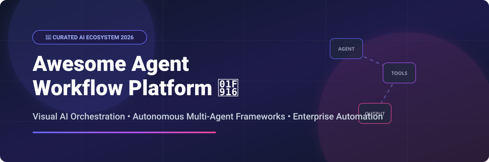

# 🤖 Awesome Agent Workflow Platform 🚀

[](https://github.com/ishandutta2007/Awesome-Agent-Workflow-Platform)

<p align="center">
  <a href="https://github.com/ishandutta2007/Awesome-Awesome-Awesome"></a>
  <a href="https://discord.gg/jc4xtF58Ve"></a>
  <a href="https://github.com/ishandutta2007"></a>
</p>

## 🌟 Top Agent Workflow & AI Orchestration Ecosystem

**A Curated Ecosystem of SaaS Platforms, Autonomous Multi-Agent Frameworks & Open-Source Workflow Automation Tools.**

> *Discover the best tools for Visual AI Orchestration, RAG Systems, Autonomous Multi-Agent Workflows, and Developer Automation.*

📅 **Last updated: March 2026**

---

This curated repository tracks leading **SaaS platforms** and high-growth **open-source GitHub projects** in the **Agent Workflow Platform** space. These solutions empower developers, enterprise architects, and AI engineers to design, orchestrate, deploy, and monitor intelligent multi-step AI agent workflows with tools, memory, RAG, API integrations, and human-in-the-loop governance.

---

## 📑 Table of Contents
- [📊 Market Insights & Landscape](#-market-insights--landscape)
- [☁️ SaaS & Hosted Agent Platforms](#️-saas--hosted-agent-platforms)
- [🔓 Open-Source GitHub Projects](#-open-source-github-projects)
- [🛠️ Architecture & Integration Patterns](#️-architecture--integration-patterns)
- [🤝 How to Contribute](#-how-to-contribute)
- [💖 Support & Sponsorship](#-support--sponsorship)
- [📈 Star History](#-star-history)
- [⚠️ Disclaimer](#️-disclaimer)

---

## 📊 Market Insights & Landscape

The **Agentic AI & Workflow Automation Market** is projected to grow from **$5.1 Billion in 2024 to over $38.5 Billion by 2030**, representing a CAGR exceeding 40%.

> [!NOTE]
> **Market Dynamics**: The market is currently **moderately fragmented**. While legacy enterprise integration vendors (e.g., Workday acquiring Flowise, Salesforce, Microsoft) are consolidating top platforms, rapid open-source innovation (Dify, n8n, CrewAI, Temporal) maintains a vibrant ecosystem where developer-first and privacy-focused self-hosted solutions thrive alongside managed cloud platforms.

---

## ☁️ SaaS & Hosted Agent Platforms

*The following managed cloud offerings provide instant visual workflow building, hosted LLM infrastructure, team collaboration, and managed auth/security. Sorted by estimated company valuation/funding scale (descending).*

| Rank | Platform | Company Scale (Valuation / Revenue) | Starting Tier Price | Free Tier / Trial Limit | Key Features |
| :---: | :--- | :--- | :--- | :--- | :--- |
| 1️⃣ | **[n8n Cloud](https://n8n.io/)** | **~$250M+ Valuation** | €20/month (Starter) | Free 14-day trial (Full features, 2,500 execution limit) | 400+ integrations, fair-code, LangChain AI nodes, visual workflow engine |
| 2️⃣ | **[Flowise Cloud](https://flowiseai.com/)** | **Acquired / Workday Scale ($100M+)** | $49/month (Pro) | Free 14-day trial (500 runs/month, 2 flow limit) | Drag-and-drop LangChain node canvas, multi-agent RAG pipelines |
| 3️⃣ | **[Pipedream](https://pipedream.com/)** | **~$60M Valuation (Series A)** | $19/month (Basic) | Free Forever (100 credits/day, unlimited workflows) | Code-first serverless workflows, managed auth, MCP server support |
| 4️⃣ | **[Dify Cloud](https://cloud.dify.ai/)** | **~$40M+ Valuation (Sequoia funded)** | $59/month (Professional) | Free Forever (200 OpenAI calls, 200 message limit) | Visual RAG pipeline builder, multi-agent orchestration, dataset management |
| 5️⃣ | **[LangFlow Cloud](https://www.langflow.org/)** | **~$30M Valuation (DataStax Scale)** | $25/month (Developer) | Free Forever (1,000 requests/month, 3 project canvas limit) | Python-native visual agent graph editor with LangChain primitives |
| 6️⃣ | **[Activepieces Cloud](https://www.activepieces.com/)** | **~$15M Valuation** | $15/month (Pro) | Free Forever (1,000 tasks/month, 10 active flows) | MIT-licensed core SaaS, 200+ native pieces, AI agent step execution |
| 7️⃣ | **[Lindy AI](https://www.lindy.ai/)** | **~$12M Funding** | $49/month (Pro) | Free Forever (100 agent task credits/month) | Autonomous AI employee templates for CRM, email, and meeting scheduling |
| 8️⃣ | **[BuildShip](https://buildship.com/)** | **~$10M Valuation** | $25/month (Starter) | Free Forever (1,000 executions/month, low-code builder) | Visual backend node builder, automated API generation, scheduled cron agents |
| 9️⃣ | **[Relay.app](https://www.relay.app/)** | **~$8M Funding** | $18/month (Standard) | Free Forever (100 runs/month, 1-on-1 human approval steps) | Human-in-the-loop workflows, collaborative playbook runner |
| 🔟 | **[Rivet AI](https://rivetai.io/)** | **~$5M Valuation** | $29/month (Creator) | Free 7-day trial (Full graph execution capabilities) | AI-powered creative production & multi-step content automation graph |

---

## 🔓 Open-Source GitHub Projects

*High-growth, community-backed open-source projects for self-hosting, custom multi-agent development, and enterprise workflow execution. Sorted by GitHub star counts (descending).*

- **[n8n](https://github.com/n8n-io/n8n)**  
  [](https://github.com/n8n-io/n8n/stargazers)  
  ⚡ *Most popular self-hostable automation platform with 400+ integrations, visual canvas, JS/Python code nodes, and LangChain AI orchestration (Fair-code).*

- **[Flowise](https://github.com/FlowiseAI/Flowise)**  
  [](https://github.com/FlowiseAI/Flowise/stargazers)  
  ⚡ *Drag-and-drop UI to build LLM apps with LangChain. Excellent for rapid prototyping of agentic RAG graphs.*

- **[LangFlow](https://github.com/langflow-ai/langflow)**  
  [](https://github.com/langflow-ai/langflow/stargazers)  
  ⚡ *Visual framework for building multi-agent and RAG applications in Python with direct LangChain alignment.*

- **[Dify](https://github.com/langgenius/dify)**  
  [](https://github.com/langgenius/dify/stargazers)  
  ⚡ *Enterprise-grade LLM application development platform combining RAG engines, prompt orchestration, observability, and agent workflows.*

- **[AutoGPT](https://github.com/Significant-Gravitas/AutoGPT)**  
  [](https://github.com/Significant-Gravitas/AutoGPT/stargazers)  
  ⚡ *Pioneering open-source autonomous agent builder with block-based visual editor and plugin ecosystem.*

- **[CrewAI](https://github.com/crewAIInc/crewAI)**  
  [](https://github.com/crewAIInc/crewAI/stargazers)  
  ⚡ *Production-ready Python framework for orchestrating teams of autonomous, role-playing AI agents.*

- **[Sim Studio](https://github.com/simstudioai/sim)**  
  [](https://github.com/simstudioai/sim/stargazers)  
  ⚡ *Open-source workspace for orchestrating AI agents with visual workflows, local Ollama/vLLM support, and Docker Compose deployment.*

- **[Activepieces](https://github.com/activepieces/activepieces)**  
  [](https://github.com/activepieces/activepieces/stargazers)  
  ⚡ *MIT-licensed AI-native enterprise automation platform. Direct open-source Zapier/n8n alternative.*

- **[Temporal](https://github.com/temporalio/temporal)**  
  [](https://github.com/temporalio/temporal/stargazers)  
  ⚡ *Open-source durable execution engine ensuring complex async multi-agent workflows survive crashes and state failures.*

- **[Node-RED](https://github.com/node-red/node-red)**  
  [](https://github.com/node-red/node-red/stargazers)  
  ⚡ *Low-code flow programming environment ideal for IoT, event-driven integrations, and edge agent execution.*

- **[Prefect](https://github.com/PrefectHQ/prefect)**  
  [](https://github.com/PrefectHQ/prefect/stargazers)  
  ⚡ *Pythonic workflow orchestration framework built for data pipelines, ML tasks, and scheduled agent jobs.*

- **[Windmill](https://github.com/windmill-labs/windmill)**  
  [](https://github.com/windmill-labs/windmill/stargazers)  
  ⚡ *Developer-first AGPLv3 platform turning Python, TypeScript, Go, or SQL scripts into production workflows and auto-generated UIs.*

- **[Huginn](https://github.com/huginn/huginn)**  
  [](https://github.com/huginn/huginn/stargazers)  
  ⚡ *System for building automated agents that perform online tasks, web monitoring, and data scraping.*

- **[Automatisch](https://github.com/automatisch/automatisch)**  
  [](https://github.com/automatisch/automatisch/stargazers)  
  ⚡ *Self-hostable business automation platform allowing seamless data transfer between services with privacy compliance.*

- **[ByteChef](https://github.com/bytechef/bytechef)**  
  [](https://github.com/bytechef/bytechef/stargazers)  
  ⚡ *Open-source embeddable low-code API integration and workflow automation engine for SaaS products.*

- **[Obsei](https://github.com/obsei-ai/obsei)**  
  [](https://github.com/obsei-ai/obsei/stargazers)  
  ⚡ *Low-code AI-powered workflow automation for collecting, analyzing, and acting upon unstructured data.*

- **[Multi-Agent Orchestrator](https://github.com/awslabs/multi-agent-orchestrator)**  
  [](https://github.com/awslabs/multi-agent-orchestrator/stargazers)  
  ⚡ *Flexible framework for managing multiple AI agents with intelligence routing and context preservation.*

- **[LoomFlow](https://github.com/banmu123/LoomFlow)**  
  [](https://github.com/banmu123/LoomFlow/stargazers)  
  ⚡ *Lightweight natural-language to visual workflow engine with instant API publishing and Docker deployment.*

- **[HumAInFlow](https://github.com/humainflow/humainflow)**  
  [](https://github.com/humainflow/humainflow/stargazers)  
  ⚡ *Research-grade Python framework for designing and simulating GenAI workflows with human-in-the-loop nodes.*

- **[p9p (Pipeline 9)](https://github.com/p9p-ai/p9p)**  
  [](https://github.com/p9p-ai/p9p/stargazers)  
  ⚡ *Community-driven open-source workflow automation alternative to n8n focusing on standard open licenses.*

---

## 🛠️ Architecture & Integration Patterns

```
                          ┌────────────────────────┐
                          │   Visual UI / Canvas   │
                          │ (Dify, Flowise, n8n)   │
                          └───────────┬────────────┘
                                      │
                                      ▼
    ┌──────────────────────────────────────────────────────────────────┐
    │                    Agent Orchestration Engine                   │
    │         - Multi-Agent Routing (CrewAI / AutoGPT / Sim)           │
    │         - Human-in-the-Loop Approval (Relay.app)                 │
    │         - RAG & Knowledge Retrieval (Dify / LangFlow)            │
    └─────────────────────────────┬────────────────────────────────────┘
                                  │
      ┌───────────────────────────┼───────────────────────────┐
      ▼                           ▼                           ▼
┌───────────────┐         ┌───────────────┐         ┌───────────────────┐
│ LLM Providers │         │ Durable State │         │ API Integrations  │
│ (OpenAI/vLLM) │         │  (Temporal)   │         │ (MCP/Pipedream)   │
└───────────────┘         └───────────────┘         └───────────────────┘
```

---

## 🤝 How to Contribute

Contributions are welcome! Please follow these simple guidelines:

1. 🍴 **Fork** the repository.
2. 📝 **Add/Edit** entries in `README.md` maintaining standard markdown formatting.
3. 📌 **Include**: Platform name, GitHub repository or project link, precise feature summary, pricing details (for SaaS), or GitHub stars badge (for Open-Source).
4. 🚀 **Submit a Pull Request** with a clear explanation of your additions.

Please review our curated guidelines in [https://github.com/ishandutta2007/Awesome-Awesome-Awesome](https://github.com/ishandutta2007/Awesome-Awesome-Awesome).

---

## 💖 Support & Sponsorship

If you find this repository helpful in building your AI agent workflow architecture:

- 🌟 **Star** this repository to help others discover it.
- 🔀 **Fork** it to keep a personal reference.
- 📢 **Share** it with your developer community and colleagues.
- ☕ **Sponsor / Buy a Coffee**: Consider supporting ongoing open-source curation and development via the [GitHub Sponsors Dashboard](https://github.com/sponsors/ishandutta2007).

Thank you for supporting open-source AI innovation! ❤️

---

## 📈 Star History

[](https://star-history.dera.page/#ishandutta2007/Awesome-Agent-Workflow-Platform&type=date&legend=top-left)

---

## ⚠️ Disclaimer

- This is a **community-curated list** provided for informational and educational purposes.
- Agent workflow platforms must comply with relevant data privacy standards (GDPR, CCPA, HIPAA) and AI safety governance.
- Self-hosted open-source software requires proper server security, network isolation, and maintenance. LLM API costs are the responsibility of the operator.

---

<p align="center">
  <b>Built with ❤️ for AI Engineers, Developers, and Automation Architects worldwide.</b>
</p>
